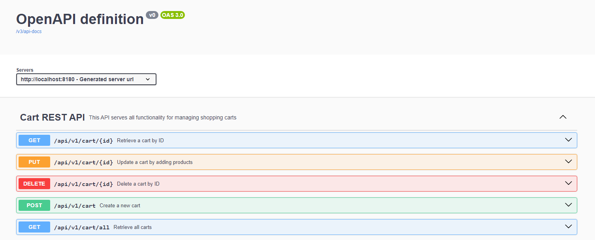

# E-commerce Backend - Shopping Cart

This project is a **microservice** for e-commerce that handles **shopping cart** management.

## Requirements

- Minimum **Java 17**
- **Maven** 3.x

## Deploying the Application

To deploy the application, follow these simple steps:

1. Clone the repository

2. Build and run the application:

   ```bash
   mvn install
   mvn spring-boot:run
   ```

   The application will run on port **8180** by default.

3. Access the application:
   - You can access the Swagger UI at:
     [http://localhost:8180/swagger-ui.html](http://localhost:8180/swagger-ui.html)



## Running Tests

The project includes **unit tests**. To run all the tests, simply use the following command:

```bash
mvn test
```

### Viewing Test Coverage

This project uses **JaCoCo** to measure the test coverage. After running the tests, you can view the test coverage report by navigating to the following directory:

```
{workspaceFolder}\microservice\target\site\jacoco\index.html
```


## Additional Notes

- Additionally, you can modify the cart inactivity timeout and the frequency at which inactive carts are validated in the `application.properties` file.

  1. `cart.inactivity.minutes`: cart inactivity timeout (in minutes)
  2. `cart.cleanup.fixedRate`: frequency of checking for inactive carts (in milliseconds)

## Future Improvements

1. **Database Integration**

2. **Reactive Programming (WebFlux)**

3. **Caching**
